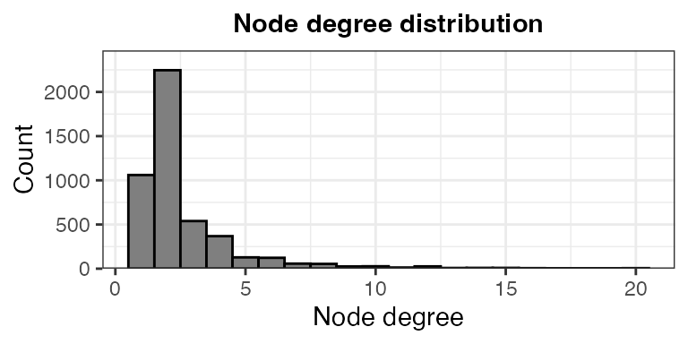
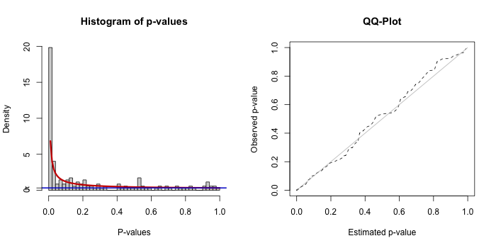
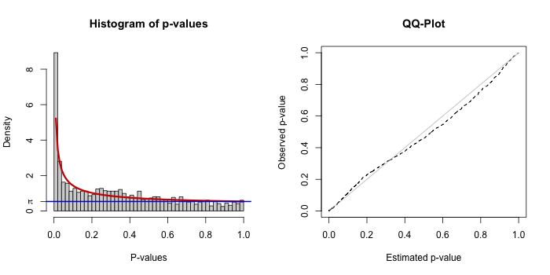
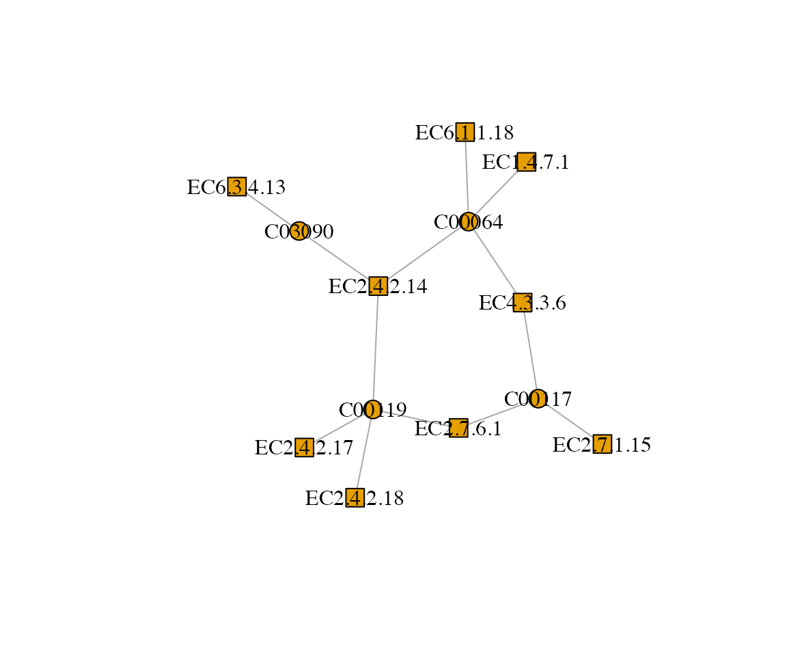
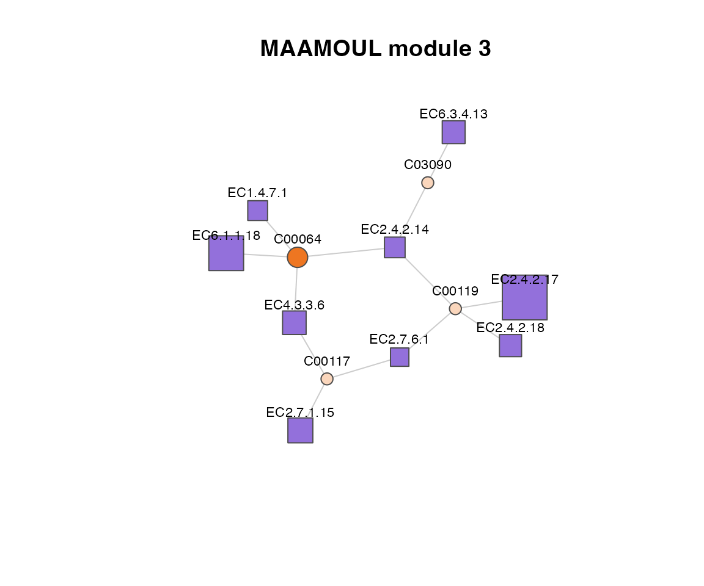

# MAAMOUL Tutorial

``` r
library(MAAMOUL)
library(igraph)
library(tidyverse)
```

## 1. Preparing input data

MAAMOUL requires three main inputs (further described below):

1.  A global metabolic network.  
2.  P-values for enzymes (ECs) or gene families.  
3.  P-values for metabolites. These p-values are derived from
    metabolomic data, indicating the association between each
    metabolite’s abundance and the phenotype of interest.

In this tutorial, we load example datasets provided with the package,
based on data from Franzosa et al., *Nature Microbiology*, 2019. We also
describe how users can generate their own inputs.

### 1.1 Global metabolic network

The global metabolic network defines the relationships between
metabolites and enzymes.  
It can be derived from databases like KEGG or MetaCyc.  
The network should be represented as a table of edges connecting
metabolite nodes to EC nodes. It can be provided as a data frame
pre-loaded into R or as a path to a `.csv` file.  
The network should be bipartite, meaning that edges only connect nodes
of different types (metabolites to ECs, not ECs to ECs or metabolites to
metabolites).

For this tutorial, we use a pre-compiled network (automatically loaded
with the package):

``` r
data(edges)
head(edges)
#> # A tibble: 6 × 2
#>   enzyme_id   compound_id
#>   <chr>       <chr>      
#> 1 EC1.1.1.10  C00379     
#> 2 EC1.1.1.10  C00312     
#> 3 EC1.1.1.102 C02934     
#> 4 EC1.1.1.102 C00836     
#> 5 EC1.1.1.103 C00188     
#> 6 EC1.1.1.103 C03508
```

Note:

- Each row in the table represents an edge;  
- Only the first two columns of the table are used; additional columns
  are ignored. Column names are ignored as well.

#### Building your own network

Users can construct a network from databases such as KEGG
(<https://www.genome.jp/kegg/>), MetaCyc (<https://metacyc.org/>), or
other resources.

When building a custom network, we recommend:

- Removing very small connected components;  
- Removing nodes with extremely high degree (hub nodes);  
  → These can dramatically influence network topology. Especially
  important for currency metabolites (e.g., water, ATP) that connect to
  many reactions and may not be informative for the specific biological
  question.  
- Filtering irrelevant ECs or metabolites based on prior knowledge;  
  → e.g., ECs not linked to bacteria when studying the gut microbiome.

#### Basic network diagnostics

To better understand your network, it is useful to inspect:

- Node degree distribution  
- Number and size of connected components  
- Total number of nodes and edges

``` r
g <- graph_from_data_frame(edges, directed = FALSE)

# Degree distribution
deg <- degree(g)
ggplot(data.frame(deg), aes(x = deg)) +
  geom_histogram(color = 'black', fill = 'grey50', bins = 20) +
  ggtitle("Node degree distribution") +
  xlab('Node degree') +
  ylab('Count') +
  scale_y_continuous(expand = expansion(mult = c(0, 0.1))) +
  theme_bw() +
  theme(plot.title = element_text(hjust = 0.5, size = 11, face = "bold"))
```



``` r

# Connected components
comp <- components(g)
sprintf("Number of connected components: %i", comp$no)
#> [1] "Number of connected components: 13"
sprintf("Largest component size: %i", max(comp$csize))
#> [1] "Largest component size: 4439"
sprintf("Smallest component size: %i", min(comp$csize))
#> [1] "Smallest component size: 10"

# Basic stats
sprintf("Number of EC nodes: %i", sum(grepl("^EC", V(g)$name)))
#> [1] "Number of EC nodes: 2172"
sprintf("Number of metabolite nodes: %i", sum(!grepl("^EC", V(g)$name)))
#> [1] "Number of metabolite nodes: 2539"
sprintf("Number of edges: %i", ecount(g))
#> [1] "Number of edges: 6253"
```

### 1.2 EC (enzyme) p-values

The second input is a table of p-values for enzyme (EC) functions
(pre-loaded into R or saved in a `.tsv` file).  
These p-values are based on the analysis of metagenomic or
metatranscriptomic data, reflecting the association between each EC’s
abundance and the phenotype of interest (e.g., disease status). They are
usually computed using differential abundance analysis methods (e.g.,
[MaAsLin3](https://www.nature.com/articles/s41592-025-02923-9),
[ALDEx2](https://link.springer.com/article/10.1186/2049-2618-2-15), or
[ANCOM](https://www.nature.com/articles/s41467-020-17041-7)).

Load pre-computed EC p-values:

``` r
data(ec_pvals)
ec_pvals %>% select(feature, pval) %>% head()
#> # A tibble: 6 × 2
#>   feature        pval
#>   <chr>         <dbl>
#> 1 EC2.7.2.8  8.71e-11
#> 2 EC1.1.1.23 7.17e-10
#> 3 EC2.4.2.17 3.46e- 9
#> 4 EC4.3.2.10 5.60e- 8
#> 5 EC1.2.1.38 7.88e- 8
#> 6 EC2.6.1.52 1.58e- 7
```

Notes:

- EC identifiers must match those given in the global network table;  
- P-value may represent associations in both directions (enriched or
  depleted in the phenotype of interest), or in a single direction
  (using one-sided statistical tests). In the pre-computed example,
  p-values represent associations in either direction.  
- The table should include at least the following columns: `feature` →
  EC identifier (must match network node names), `pval` → statistical
  significance of association with the phenotype, before multiple
  testing correction. Additional columns (e.g., effect size, adjusted
  p-value) can be included but are not required.

### 1.3 Metabolite p-values

Similarly, MAAMOUL requires p-values for metabolites, derived from
metabolomic data.

``` r
data(mtb_pvals)
mtb_pvals %>% select(feature, pval) %>% head()
#> # A tibble: 6 × 2
#>   feature     pval
#>   <chr>      <dbl>
#> 1 C05794  2.36e-12
#> 2 C05793  2.18e-12
#> 3 C16527  8.91e-10
#> 4 C00624  1.21e- 9
#> 5 C16513  2.66e- 9
#> 6 C16513  3.44e- 9
```

Metabolite identifiers must match node names in the metabolic network.

### Inspect input data

It is useful to inspect how well the observed features overlap with the
network. If most of the observed features are missing from the network,
consider building a custom network that better captures the observed
features.

``` r
all_net_nodes <- unique(c(edges[[1]], edges[[2]]))

sprintf(
  "%i of %i observed EC features (features with a p-value) are included in the network.",
  sum(ec_pvals$feature %in% all_net_nodes),
  nrow(ec_pvals)
)
#> [1] "1023 of 1597 observed EC features (features with a p-value) are included in the network."

sprintf(
  "%i of %i observed metabolite features (features with a p-value) are included in the network.",
  sum(mtb_pvals$feature %in% all_net_nodes),
  nrow(mtb_pvals)
)
#> [1] "143 of 237 observed metabolite features (features with a p-value) are included in the network."
```

## 2. Running MAAMOUL

Once the input data are prepared, MAAMOUL can be run to identify
metabolic modules (subnetworks) that include both metagenomic-based ECs
and metabolomic-based metabolites that are associated with the phenotype
of interest.

This step may take a few minutes to run. In real analyses, it may take
longer (e.g., tens of minutes), depending on the size of the network,
the number of repeats (`N_REPEATS`; controls how many times do we
randomly assign p-values for unobserved nodes), and the number of
permutations (`N_VAL_PERM`; controls the number of times p-values are
permuted across network nodes, to evaluate the significance of the
identified modules). In this tutorial we use `N_VAL_PERM = 9` to keep
runtime short. However, for real analyses, we strongly recommend using a
much larger number of permutations (e.g., ≥99 or more), in order to
obtain a reliable estimate of modules’ significance.

``` r
res <- maamoul(
  global_network_edges = edges,
  ec_pvals = ec_pvals,
  metabolite_pvals = mtb_pvals,
  out_dir = "test_outputs",
  N_REPEATS = 100,
  N_VAL_PERM = 9,
  N_THREADS = 2
)
#> Warning: package 'graph' was built under R version 4.4.2
#> INFO [2026-03-27 11:11:11] Output directory "test_outputs" already exists. Files may be overriden.
#> INFO [2026-03-27 11:11:11] Working directory is: /Users/em2035/Library/CloudStorage/OneDrive-UniversityofCambridge/Documents/GitHub/MAAMOUL/vignettes.
#> INFO [2026-03-27 11:11:11] Starting module-identification pipeline.
#> INFO [2026-03-27 11:11:11] Note that 63 duplicated metabolites were identified and only the ones with minimal p-values are kept.
#> INFO [2026-03-27 11:11:11] Note that 29 duplicated ECs were identified and only the ones with minimal p-values are kept.
#> INFO [2026-03-27 11:11:11] Loaded network information and feature p-values.
#> INFO [2026-03-27 11:11:11] 99 of 174 observed metabolite features are also in the network.
#> INFO [2026-03-27 11:11:11] 1004 of 1568 observed EC features are also in the network.
#> INFO [2026-03-27 11:11:11] 1103 of 4711 network nodes are observed in the data.
#> INFO [2026-03-27 11:11:11] Metabolite p-value threshold based on BUM: 0.1989.
#> INFO [2026-03-27 11:11:11] EC p-value threshold based on BUM: 0.0461.
#> INFO [2026-03-27 11:11:11] Found 255 EC anchor nodes and 69 metabolite anchor nodes.
#> INFO [2026-03-27 11:11:11] Constructed a node-weighted network, with 4711 nodes and 6253 edges.
#> INFO [2026-03-27 11:11:11] Starting graph random coloring iterations
#> .INFO [2026-03-27 11:11:38] End of graph random coloring iterations
#> INFO [2026-03-27 11:11:40] Identified a total of 41 modules (before significance testing).
#>   |                                                                              |                                                                      |   0%INFO [2026-03-27 11:11:44] Starting graph random coloring iterations - permuted graphs.
#>   |                                                                              |========                                                              |  11%  |                                                                              |================                                                      |  22%  |                                                                              |=======================                                               |  33%  |                                                                              |===============================                                       |  44%  |                                                                              |=======================================                               |  56%  |                                                                              |===============================================                       |  67%  |                                                                              |======================================================                |  78%  |                                                                              |==============================================================        |  89%  |                                                                              |======================================================================| 100%INFO [2026-03-27 11:14:29] Finished graph random coloring iterations - permuted graphs.
#> INFO [2026-03-27 11:14:29] Computed modules' significance.
#> INFO [2026-03-27 11:14:35] Done!
print("MAAMOUL run completed. Results written to 'test_outputs/'.")
#> [1] "MAAMOUL run completed. Results written to 'test_outputs/'."
```

See
[`?maamoul`](https://borenstein-lab.github.io/MAAMOUL/reference/maamoul.md)
for details about the parameters.

Results would then be found in the `test_outputs` directory (we will
explore these outputs in the next section):

``` r
list.files("test_outputs")
#> [1] "anchors_dendogram.svg"        "bum_parameters.csv"          
#> [3] "complete_modules.csv"         "ec_bum_fit.png"              
#> [5] "graph_and_data.rdata"         "modules_overview.csv"        
#> [7] "mtb_bum_fit.png"              "true_vs_permuted_modules.png"
```

## 3. Inspecting and interpreting results

In this section, we walk through the key outputs and how to interpret
them.

### 3.1 Checking p-value model fit

MAAMOUL models the distribution of input p-values using a beta-uniform
mixture (BUM) model, which helps distinguish signal from background
noise.

Two diagnostic plots are generated:

- `mtb_bum_fit.png`  
- `ec_bum_fit.png`

``` r

```


``` r

```


Each plot includes a histogram of p-values with the fitted BUM model
(left) and a Q-Q plot comparing observed vs expected distributions
(right).

A reasonable fit will have:

- Enrichment of low p-values (left side)  
- A smooth fit of the model to the histogram  
- A Q-Q plot roughly follows the diagonal

⚠️️ What to do if the fit is poor:

A poor BUM fit typically indicates that there are too few strongly
associated features (“anchor nodes”) or that the input signal is weak or
noisy. In some cases, this simply reflects the underlying biology or the
available data, and MAAMOUL may not identify meaningful modules. If this
is unexpected, users may wish to verify that the input p-values were
computed appropriately (e.g., using suitable normalization and
statistical models), and that relevant features are well represented in
the network.

👉 MAAMOUL relies on having a sufficient number of informative nodes to
build meaningful modules.

### 3.2 Overview of identified modules

The file `modules_overview.csv` summarizes all detected modules:

``` r
modules_overview <- read.csv("test_outputs/modules_overview.csv")
head(modules_overview)
#>   module_id n_anchors n_anchors_metabs n_anchors_ECs mean_pval_anchors
#> 1         1         4                1             3       0.014036774
#> 2         2         6                1             5       0.013219504
#> 3         3        10                1             9       0.004945160
#> 4         4         6                3             3       0.031702722
#> 5         5         9                3             6       0.017673184
#> 6         6         5                1             4       0.003197565
#>   module_pval module_FDR
#> 1         0.1  0.1138889
#> 2         0.1  0.1138889
#> 3         0.1  0.1138889
#> 4         0.1  0.1138889
#> 5         0.1  0.1138889
#> 6         0.1  0.1138889
```

Alternatively, users can load the .RData file that contains the same
data frame (and additional objects):

``` r
# load("test_outputs/graph_and_data.rdata")
# head(modules_overview)
```

**Key columns**

- `module_id` → unique identifier of the module  
- `n_anchors_metabs` → number of significant disease-associated
  metabolites included in this module  
- `n_anchors_ECs` → number of significant disease-associated ECs
  included in this module  
- `module_pval` → permutation-based module significance  
- `module_FDR` → FDR-corrected significance

Useful questions to ask:

- How many modules were identified?  
- How many are statistically significant (e.g., FDR \< 0.1)?  
- Do some modules include both disease-associated ECs and
  disease-associated metabolites?

Modules that include both data types are often the most biologically
informative, as they link functional potential with metabolic outcomes.

If no significant modules are found, check the following:

- Do you have enough significant ECs and metabolites?
- Do these features overlap with the network?
- Is the network sufficiently connected?
- Are parameters (e.g., `N_REPEATS`, `N_VAL_PERM`) too low?

Note: In this tutorial, we used a small number of permutations for speed
(`N_VAL_PERM = 9`). This led to coarse p-value estimates. 👉 For real
analyses, increase this substantially (e.g., ≥99).

### 3.3 Exploring individual modules

Once interesting modules are identified, you can inspect them in detail.

The file `complete_modules.csv` contains all nodes assigned to each
module:

``` r
complete_modules <- read.csv("test_outputs/complete_modules.csv")
complete_modules %>%
  filter(module_id == 1)
#>         node is_anchor module_id         pval       type
#> 1     C00041      TRUE         1 0.0086331438 Metabolite
#> 2     C01528     FALSE         1           NA Metabolite
#> 3     C05172     FALSE         1           NA Metabolite
#> 4  EC2.7.9.3      TRUE         1 0.0053129691         EC
#> 5  EC2.9.1.1      TRUE         1 0.0414594908         EC
#> 6 EC4.4.1.16     FALSE         1 0.0838195436         EC
#> 7  EC6.1.1.7      TRUE         1 0.0007414908         EC
```

#### Visualizing a module as a network

You can visualize a specific module using the underlying graph.

First, load the graph object:

``` r
load("test_outputs/graph_and_data.rdata")
```

This provides `g_init` → the full metabolic network (igraph object).

Then extract and plot the module:

``` r
# Get nodes in module 1
module_nodes <- complete_modules %>%
  filter(module_id == 3) %>%
  pull(node)

# Induce subgraph
g_sub <- induced_subgraph(g_init, vids = module_nodes)

# Basic plot
plot(g_sub, vertex.size = 10, vertex.label.color = "black")
```



Or use a more advanced visualization:

``` r
## Color nodes by type
type_colors <- c(
  "Metabolite" = "chocolate2",
  "EC" = "mediumpurple"
)

## Use lighter shaed for nodes not observed in the actual data (not measured by metagenomics/metabolomics)
light_colors <- c(
  "Metabolite" = "#FAD6BC",
  "EC" = "#DFD4F4"
)

node_type <- as.character(V(g_sub)$type)
is_observed <- !is.na(V(g_sub)$pval)
V(g_sub)$color <- ifelse(
  is_observed,
  type_colors[node_type],
  light_colors[node_type]
)

## Size based on p-value (inverse relationship)
## Add small epsilon to avoid log(0)
eps <- 1e-10
pvals <- V(g_sub)$pval + eps
pvals[is.na(pvals)] <- 1 # Replace invalid values
sizes <- -log10(pvals)
V(g_sub)$size <- scales::rescale(sizes, to = c(8, 30)) # Rescale

## Plot
plot(
  g_sub,
  vertex.frame.color = "grey30",
  edge.color = "grey80",
  vertex.label.color = "black",
  vertex.label.cex = 0.7,
  vertex.label.family = "sans",
  vertex.label.dist = 1.7,   # move labels outward
  vertex.label.degree = 3*pi/2,   
  main = "MAAMOUL module 3"
)
```



### 3.4 Possible next steps

**Compare modules to known metabolic pathways**

You may want to assess whether identified modules overlap with known
metabolic pathways (e.g., from KEGG or MetaCyc). This can help
contextualize the module within known biological processes, and possibly
highlight specific areas of the pathway that are specifically perturbed
in disease states. Some modules may also lie on the intersection of
several metabolic pathways.

**Examine direction of association**

While MAAMOUL identifies modules enriched for significant features, it
is also important to examine the direction of effects: Are
ECs/metabolites consistently increased or decreased in disease? Do
modules show coherent trends, or mixed signals?

**Integrate with external data**

Where possible, integrate modules with other data sources such as
additional host phenotypes or clinical variables, other omics layers
(e.g., transcriptomics, proteomics), or dietary data. This can help
place modules in a broader biological context.

**Map ECs back to taxa**

Given our microbiome focus, you may want to check: Which taxa encode the
ECs in a module? Are specific microbes driving the signal?

**Identify hub or key driver nodes**

Nodes with high connectivity within modules and highly significant
disease-assocations may represent key functional drivers of a module.

**Visualize raw data**

To better understand the direction and magnitude of associations, users
may wish to inspect the underlying data for features within a module.
This can be done using boxplots, density plots, or heatmaps of feature
abundances across samples, stratified by phenotype.

**Validate findings**

To further verify the robustness of your identified modules, you may
want to replicate your findings in independent datasets, perform
sensitivity analyses (e.g., varying parameters), or compare with
alternative methods (e.g. standard pathway-level analysis, for each omic
independetly).
